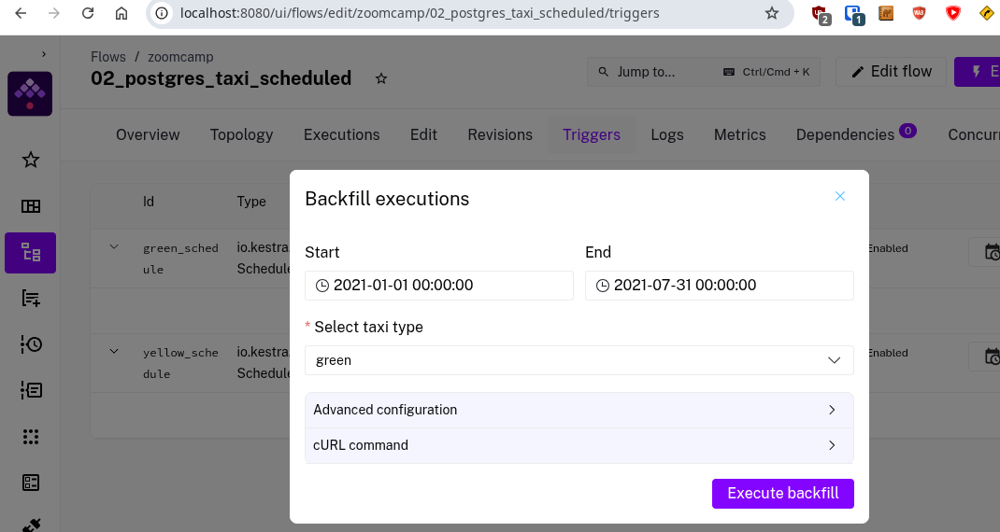
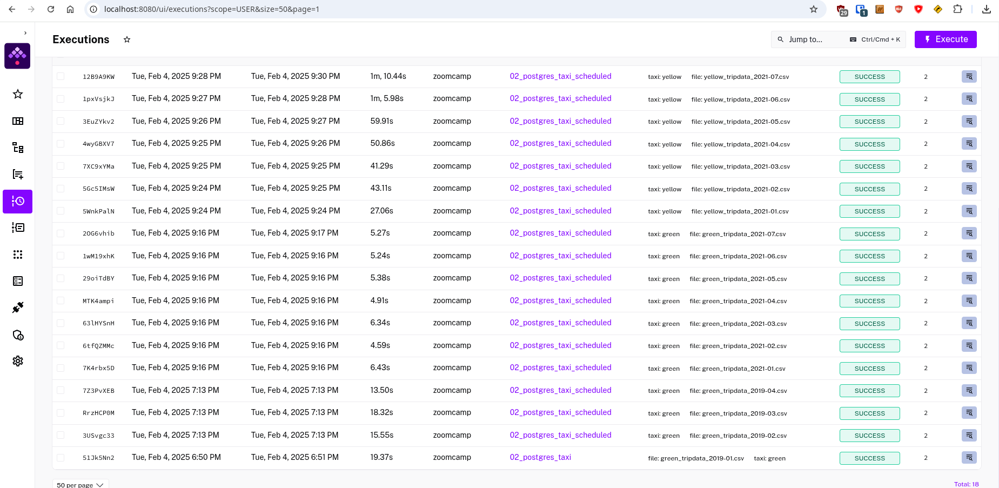
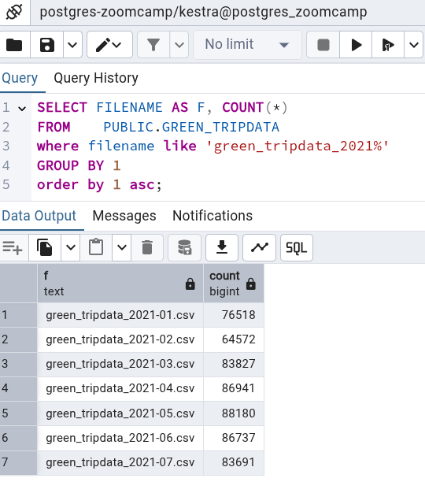
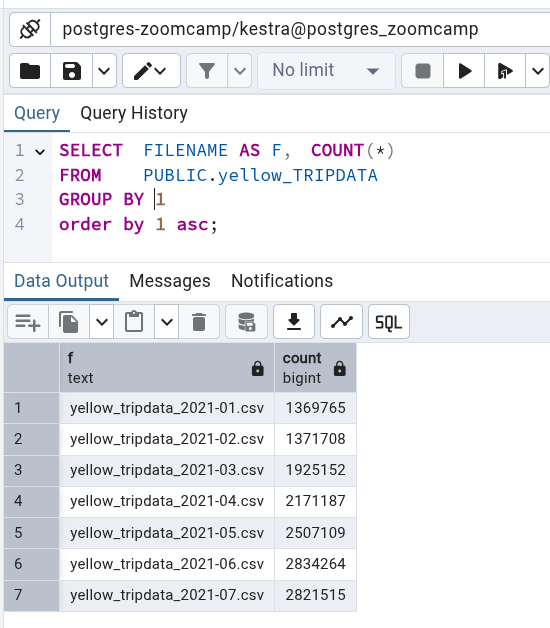

# Setting up the Environment:
1. Open terminal and navigate to working directory of `docker_compose.yaml` file and run following command.
```bash
docker compose up -d
```
2. Upload `postgres_taxi_scheduled.yaml` to Kestra by using following command
```bash
curl -X POST http://localhost:8080/api/v1/flows/import -F fileUpload=@flows/postgres_taxi_scheduled.yaml
```
3. To use the back fill option, Navigate to Triggers and select appropriate options like shown in the screenhot below for Green taxi. The same applies to Yellow taxi data 


4. Screenshot below shows successful completion of all ingest triggers for 2021.


5. Validating the results using SQL can be done by using PgAdmin. See screenshots below for both Green and Yellow taxi trips for 2021.





# Homework

Please see homework.md files for answers with screenshots included. 