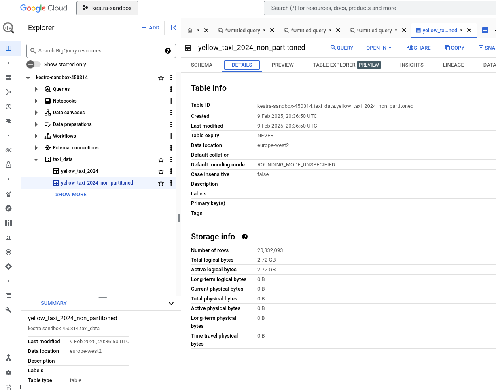
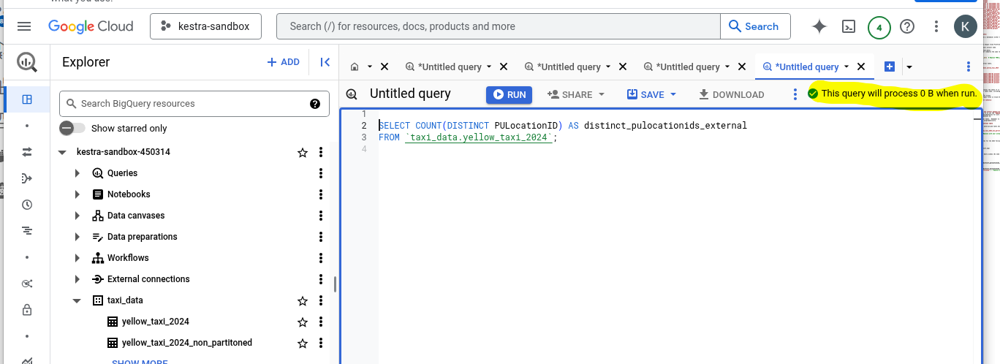
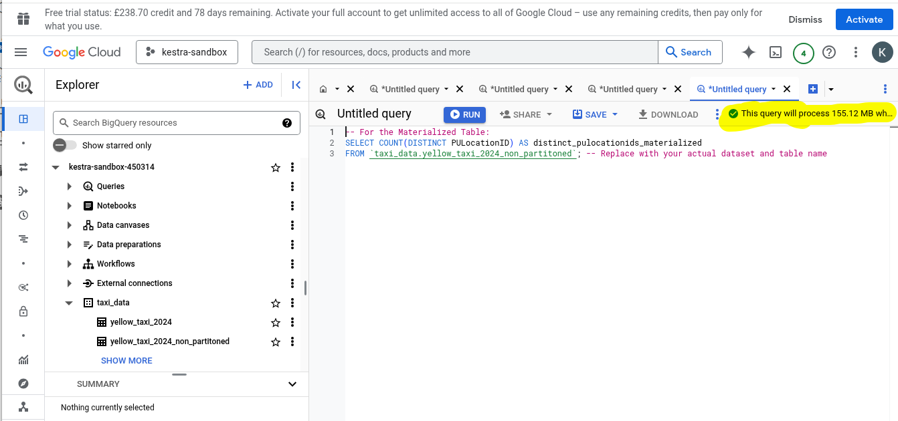
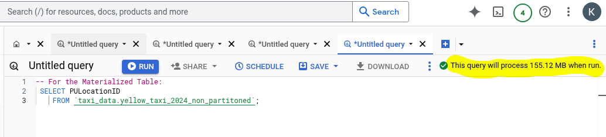
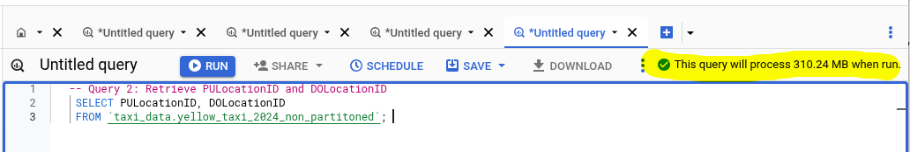
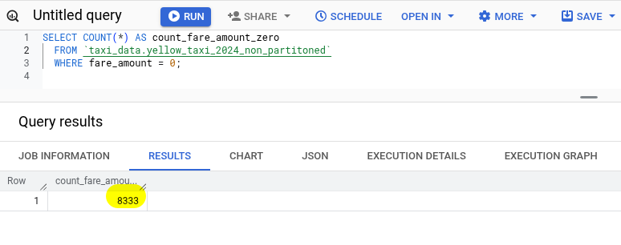
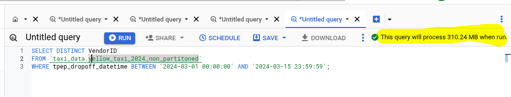
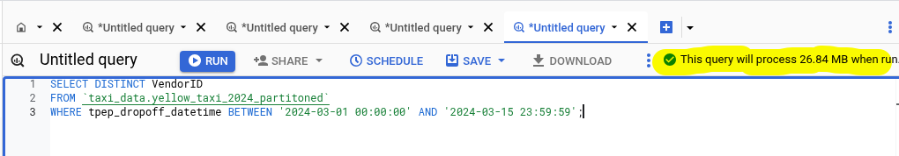
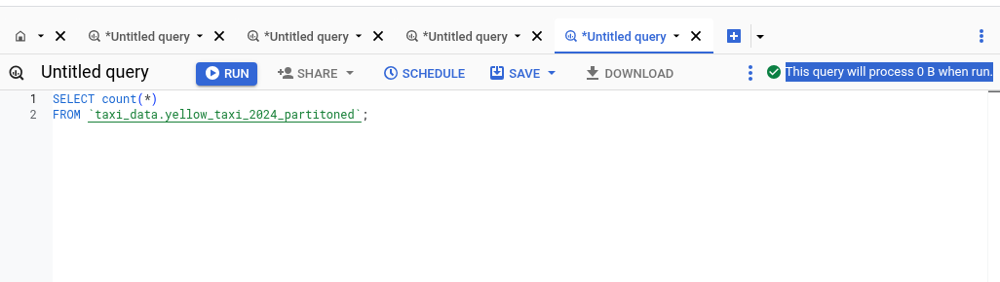

# Upload the dataset to GCS

1. Create a storage bucket in GCP. In my case I created following storage bucket `kmajeeddev_hw3_2025`
2. Update the `load_yellow_taxi_data.py` file as required and then run the following command in the terminal to upload the parquet files to GCP
```bash
python 01_load_yellow_taxi_data.py
```
You will see output like this

```bash
Downloading https://d37ci6vzurychx.cloudfront.net/trip-data/yellow_tripdata_2024-01.parquet...
Downloading https://d37ci6vzurychx.cloudfront.net/trip-data/yellow_tripdata_2024-02.parquet...
Downloading https://d37ci6vzurychx.cloudfront.net/trip-data/yellow_tripdata_2024-03.parquet...
Downloading https://d37ci6vzurychx.cloudfront.net/trip-data/yellow_tripdata_2024-04.parquet...
Downloaded: ./yellow_tripdata_2024-02.parquet
Downloading https://d37ci6vzurychx.cloudfront.net/trip-data/yellow_tripdata_2024-05.parquet...
Downloaded: ./yellow_tripdata_2024-03.parquet
Downloading https://d37ci6vzurychx.cloudfront.net/trip-data/yellow_tripdata_2024-06.parquet...
Downloaded: ./yellow_tripdata_2024-01.parquet
Downloaded: ./yellow_tripdata_2024-04.parquet
Downloaded: ./yellow_tripdata_2024-06.parquet
Downloaded: ./yellow_tripdata_2024-05.parquet
Uploading ./yellow_tripdata_2024-01.parquet to kmajeeddev_hw3_2025 (Attempt 1)...
Uploading ./yellow_tripdata_2024-02.parquet to kmajeeddev_hw3_2025 (Attempt 1)...
Uploading ./yellow_tripdata_2024-03.parquet to kmajeeddev_hw3_2025 (Attempt 1)...
Uploading ./yellow_tripdata_2024-04.parquet to kmajeeddev_hw3_2025 (Attempt 1)...
Uploaded: gs://kmajeeddev_hw3_2025/yellow_tripdata_2024-02.parquet
Verification successful for yellow_tripdata_2024-02.parquet
Uploading ./yellow_tripdata_2024-05.parquet to kmajeeddev_hw3_2025 (Attempt 1)...
Uploaded: gs://kmajeeddev_hw3_2025/yellow_tripdata_2024-01.parquet
Verification successful for yellow_tripdata_2024-01.parquet
Uploading ./yellow_tripdata_2024-06.parquet to kmajeeddev_hw3_2025 (Attempt 1)...
Uploaded: gs://kmajeeddev_hw3_2025/yellow_tripdata_2024-03.parquet
Verification successful for yellow_tripdata_2024-03.parquet
Uploaded: gs://kmajeeddev_hw3_2025/yellow_tripdata_2024-04.parquet
Verification successful for yellow_tripdata_2024-04.parquet
Uploaded: gs://kmajeeddev_hw3_2025/yellow_tripdata_2024-05.parquet
Verification successful for yellow_tripdata_2024-05.parquet
Uploaded: gs://kmajeeddev_hw3_2025/yellow_tripdata_2024-06.parquet
Verification successful for yellow_tripdata_2024-06.parquet
All files processed and verified.
```

# Creating a Dataset (Database) in BigQuery:

You can create a dataset (which acts like a database) either through the BigQuery console or using the command-line tool (bq).  Here's how to do it both ways:

- BigQuery Console:

    1. Go to the BigQuery console in the Google Cloud Platform.
    2. Select your project.
    3. In the Explorer panel, click on your project name.
    4. Click "CREATE DATASET".
    5. Give your dataset a name (e.g., taxi_data).
    6. Choose a location for your dataset (ideally the same region as   your storage bucket for performance).
    7. Click "Create dataset".
- `bq` command-line tool:
    ```bash
    bq mk --location=YOUR_LOCATION taxi_data  # Replace YOUR_LOCATION with your desired region (e.g., US)
    ```
# SQL to Create the External Table:

Use the following SQL to create the external table.

```SQL
CREATE OR REPLACE EXTERNAL TABLE `taxi_data.yellow_taxi_2024`
OPTIONS (
  format = 'PARQUET',
  uris = [
    'gs://kmajeeddev_hw3_2025/yellow_tripdata_2024-01.parquet',
    'gs://kmajeeddev_hw3_2025/yellow_tripdata_2024-02.parquet',
    'gs://kmajeeddev_hw3_2025/yellow_tripdata_2024-03.parquet',
    'gs://kmajeeddev_hw3_2025/yellow_tripdata_2024-04.parquet',
    'gs://kmajeeddev_hw3_2025/yellow_tripdata_2024-05.parquet',
    'gs://kmajeeddev_hw3_2025/yellow_tripdata_2024-06.parquet',
    'gs://kmajeeddev_hw3_2025/yellow_tripdata_2024-07.parquet'
  ]
);
```
## Explanation:
- `CREATE OR REPLACE EXTERNAL TABLE:` Creates the table if it doesn't exist, or replaces it if it does.
- `taxi_data.yellow_taxi_2024`: The full table name, including the dataset (database) name. Replace taxi_data with the actual name of your dataset.
- `OPTIONS:` Specifies the table options.
- `format = 'PARQUET'`: Indicates the data format.
- `uris:` A list of the URIs of your Parquet files in Cloud Storage. Make sure these paths are correct.

#  Python Code (using the BigQuery client library):
Execute following command from terminal

```bash
python 02_create_external_table.py
```

**Before running:**
- Install the BigQuery client library: `pip install google-cloud-bigquery`
- Set up authentication: The easiest way is to set the `GOOGLE_APPLICATION_CREDENTIALS` environment variable to the path of your service account key file. See the Google Cloud documentation for more details on authentication.
- Replace "taxi_data" with your actual dataset ID.

This Python code will create the external table.  Remember to adjust the dataset ID and file paths as needed.  Using the client library allows you to manage BigQuery resources programmatically.

# Create a non partitioned table from external table

Using the following SQL to create a new materialized table which is not partitioned or bucketed.

```sql
CREATE OR REPLACE TABLE `taxi_data.yellow_taxi_2024_non_partitoned` AS
SELECT *
FROM `taxi_data.yellow_taxi_2024`;  -- Replace with your actual dataset and external table name
```

# Questions

- **Question 1:** What is count of records for the 2024 Yellow Taxi Data?

The number of rows is 20,332,093

See screenshot below 
    

- **Question 2:** Write a query to count the distinct number of PULocationIDs for the entire dataset on both the tables.</br> 
What is the **estimated amount** of data that will be read when this query is executed on the External Table and the Table?

    Paste following scripts one by one into Query window (No need to execute them) and BigQuery will show the following answers on the top right

    ```SQL
    -- For the External Table:
    SELECT COUNT(DISTINCT PULocationID) AS distinct_pulocationids_external
    FROM `taxi_data.yellow_taxi_2024`;

    -- For the Materialized Table:
    SELECT COUNT(DISTINCT PULocationID) AS distinct_pulocationids_materialized
    FROM `taxi_data.yellow_taxi_2024_non_partitoned`; 
    ```

    - 0 MB for the External Table
        

    -  155.12 MB for the Materialized Table
        

- **Question 3:** Write a query to retrieve the PULocationID from the table (not the external table) in BigQuery. Now write a query to retrieve the PULocationID and DOLocationID on the same table. Why are the estimated number of Bytes different?

    ```SQL
    -- Query 1: Retrieve only PULocationID
    SELECT PULocationID
    FROM `taxi_data.yellow_taxi_2024_non_partitoned`;  

    -- Query 2: Retrieve PULocationID and DOLocationID
    SELECT PULocationID, DOLocationID
    FROM `taxi_data.yellow_taxi_2024_non_partitoned`; 
    ```
    According to BQ, first query will process 155.12 MB when run.  
 
    According to BQ, first query will process 155.12 MB when run.  

    **Why the estimated number of bytes is different:**

    The difference in estimated bytes processed is due to the amount of data BigQuery needs to read to satisfy the query.

    - Query 1 (PULocationID only): BigQuery only needs to read the data within the PULocationID column.  Because BigQuery's storage is columnar, it can efficiently read just the data for that column.  The estimated bytes will be roughly proportional to the size of the PULocationID column in your table.

    - Query 2 (PULocationID and DOLocationID): BigQuery now needs to read the data for both the PULocationID and the DOLocationID columns.  The estimated bytes processed will be approximately the sum of the sizes of these two columns.  It will be larger than Query 1 because it's reading more data.

    **Key Point: Columnar Storage:**

    BigQuery's columnar storage format is crucial here.  It allows BigQuery to read only the columns specified in your query, which significantly improves performance and reduces the amount of data processed (and therefore the cost).  If BigQuery used row-based storage, it would have to read entire rows even if you only needed a few columns, which would be much less efficient.

**Question 4:** How many records have a fare_amount of 0?

Using the following query we get an answer of 8,333 records.#

```SQL
SELECT COUNT(*) AS count_fare_amount_zero
  FROM `taxi_data.yellow_taxi_2024_non_partitoned`
 WHERE fare_amount = 0;
```
 

**Question 5:** What is the best strategy to make an optimized table in Big Query if your query will always filter based on `tpep_dropoff_datetime` and order the results by `VendorID` (Create a new table with this strategy)

The best strategy for optimizing a BigQuery table when you consistently filter by `tpep_dropoff_datetime` and order by `VendorID` is to cluster by `VendorID` and partition by `tpep_dropoff_datetime`.

Here's why and how:

Why this strategy?

Partitioning by `tpep_dropoff_datetime`: Partitioning divides your table into smaller, more manageable segments based on the date of the drop-off time.  This is excellent for filtering because when you query with a `WHERE` clause involving `tpep_dropoff_datetime`, BigQuery can quickly identify and scan only the relevant partitions, drastically reducing the amount of data processed.

Clustering by `VendorID`: Clustering sorts the data within each partition based on the `VendorID`.  This is ideal for ordering because when you use ORDER BY `VendorID`, BigQuery can retrieve the results in the desired order without having to perform a full sort operation. This significantly improves query performance.

- SQL to Create the Optimized Table:
```sql
CREATE OR REPLACE TABLE `taxi_data.yellow_taxi_2024_partitoned`
PARTITION BY DATE(tpep_dropoff_datetime)  -- Partition by date
CLUSTER BY VendorID                   -- Cluster by VendorID
AS
SELECT *
FROM `taxi_data.yellow_taxi_2024_non_partitoned`; 
```
**Quertion 6:** Write a query to retrieve the distinct VendorIDs between tpep_dropoff_datetime 2024-03-01 and 2024-03-15 (inclusive)

Use the materialized table you created earlier in your from clause and note the estimated bytes. Now change the table in the from clause to the partitioned table you created for question 5 and note the estimated bytes processed. What are these values?

Using non partitioned table, BQ will utilize 310.24MB
```sql
-- Using non optimized table
SELECT DISTINCT VendorID
FROM `taxi_data.yellow_taxi_2024_non_partitoned`
WHERE tpep_dropoff_datetime BETWEEN '2024-03-01 00:00:00' AND '2024-03-15 23:59:59';
```


Using partitioned table, BQ will utilize 26.84MB
```sql
-- Using optimized table
SELECT DISTINCT VendorID
FROM `taxi_data.yellow_taxi_2024_partitoned`
WHERE tpep_dropoff_datetime BETWEEN '2024-03-01 00:00:00' AND '2024-03-15 23:59:59'; 
```


**Question 7:** Where is the data stored in the External Table you created?

The data in the external table you created is stored in Google Cloud Storage (Bucket). Specifically, it resides in the Parquet files that you specified when you created the table:

```sql
uris = [
    'gs://kmajeeddev_hw3_2025/yellow_tripdata_2024-01.parquet',
    'gs://kmajeeddev_hw3_2025/yellow_tripdata_2024-02.parquet',
    'gs://kmajeeddev_hw3_2025/yellow_tripdata_2024-03.parquet',
    # ... other files
]
```

*Key Points:*

- External tables are just metadata: The external table in BigQuery itself doesn't store the actual data. It only stores metadata – information about where the data is located (the URIs of the files in Cloud Storage), the format of the data (Parquet), and the schema (column names and data types).   
- Data lives in Cloud Storage: The Parquet files in Cloud Storage bucket (kmajeeddev_hw3_2025 in my case) are where the actual data resides.
- Querying external tables: When you query an external table, BigQuery reads the data directly from the files in Cloud Storage at the time of the query. This means you don't need to load the data into BigQuery storage, saving on storage costs. However, querying external tables can sometimes be slower than querying managed BigQuery tables.   

*In contrast:*

The optimized table we created later is a managed table within BigQuery. The data for this table is stored in BigQuery's internal storage system. This is why querying it is generally faster but incurs storage costs.


**Question 8:** It is best practice in Big Query to always cluster your data:

**False.** While clustering is often beneficial, it's not best practice to always cluster your data in BigQuery.  Here's why:

- *Clustering has a cost:* Clustering can slightly increase storage costs. While usually outweighed by query cost savings, it's not free.
- Clustering is most effective for specific query patterns: Clustering is designed to optimize queries that filter and/or order by the clustering columns. If your queries don't frequently use those columns, clustering might not provide much benefit and could even be a slight overhead.
- Over-clustering can be detrimental: Clustering too many columns or clustering on columns with high cardinality (many distinct values) can actually hurt performance. It can lead to "hot spots" where some clusters become too large and slow down queries.
- Partitioning is often more important: Partitioning is often a more impactful optimization than clustering, especially for large tables. Partitioning by date or other relevant criteria can significantly reduce the amount of data scanned by queries.
- Sometimes no clustering is best: For very small tables or tables with very simple query patterns, clustering might not be necessary at all. The overhead of clustering could outweigh the benefits.

Best Practice is Contextual:

The best practice in BigQuery is to choose your optimization strategy (partitioning, clustering, or none) based on your specific data, query patterns, and cost considerations.  It's a balancing act.

- Analyze your queries: What columns do you frequently filter on? What columns do you often use in ORDER BY clauses?
- Consider your data: How large is your table? What is the cardinality of your columns?
- Test and iterate: Experiment with different partitioning and clustering strategies and measure the impact on query performance and cost.

So, while clustering is a powerful tool in BigQuery, it's not a "one-size-fits-all" solution.  It should be used strategically, not as a blanket rule.  Partitioning is often the first and most important optimization to consider.

**Question 9**  Write a SELECT count(*) query FROM the materialized table you created. How many bytes does it estimate will be read? Why?

This query will process 0 B when run.

```sql
SELECT count(*)
FROM `taxi_data.yellow_taxi_2024_partitoned`;
```


The estimated number of bytes read for this SELECT COUNT(*) query against your materialized table (optimized_taxi_table) will be very small.

*Why?*

- Metadata-only operation: COUNT(*) is a metadata operation. BigQuery doesn't need to scan the actual data rows to determine the count. It can retrieve this information directly from the table's metadata.  BigQuery keeps track of the number of rows in a table.

- Minimal bytes: The number of bytes read will be tiny—just the amount of data needed to retrieve the row count from the metadata.  It will be significantly less than any query that reads the actual data rows.