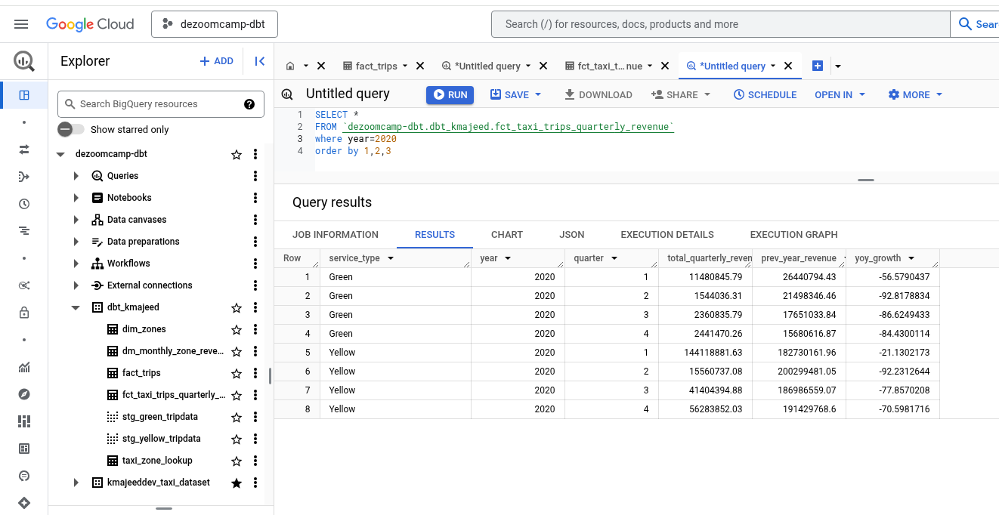
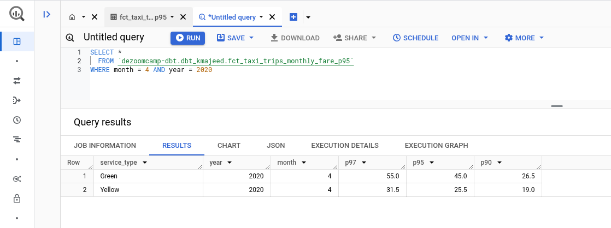
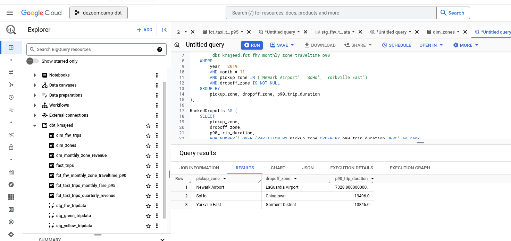

### Question 1: Understanding dbt model resolution

Provided you've got the following sources.yaml
```yaml
version: 2

sources:
  - name: raw_nyc_tripdata
    database: "{{ env_var('DBT_BIGQUERY_PROJECT', 'dtc_zoomcamp_2025') }}"
    schema:   "{{ env_var('DBT_BIGQUERY_SOURCE_DATASET', 'raw_nyc_tripdata') }}"
    tables:
      - name: ext_green_taxi
      - name: ext_yellow_taxi
```

with the following env variables setup where `dbt` runs:
```shell
export DBT_BIGQUERY_PROJECT=myproject
export DBT_BIGQUERY_DATASET=my_nyc_tripdata
```

What does this .sql model compile to?
```sql
select * 
from {{ source('raw_nyc_tripdata', 'ext_green_taxi' ) }}
```

- `select * from dtc_zoomcamp_2025.raw_nyc_tripdata.ext_green_taxi`
- `select * from dtc_zoomcamp_2025.my_nyc_tripdata.ext_green_taxi`
- `select * from myproject.raw_nyc_tripdata.ext_green_taxi`
- `select * from myproject.my_nyc_tripdata.ext_green_taxi`
- `select * from dtc_zoomcamp_2025.raw_nyc_tripdata.green_taxi`

#### Answer:
Let's break down how dbt resolves the `{{ source(...) }}` macro and determine the correct compiled SQL.

**Understanding dbt's `{{ source(...) }}` Macro**

The `{{ source(...) }}` macro in dbt is used to reference tables defined in your `sources.yml` files. It dynamically constructs the fully qualified table name based on the configuration you've provided.

**Analyzing the `sources.yml` and Environment Variables**

* **`sources.yml`:**
    * `database: "{{ env_var('DBT_BIGQUERY_PROJECT', 'dtc_zoomcamp_2025') }}"`: This line tells dbt to use the value of the environment variable `DBT_BIGQUERY_PROJECT` as the database (project) name. If the environment variable is not set, it defaults to `dtc_zoomcamp_2025`.
    * `schema: "{{ env_var('DBT_BIGQUERY_SOURCE_DATASET', 'raw_nyc_tripdata') }}"`: This line tells dbt to use the value of the environment variable `DBT_BIGQUERY_SOURCE_DATASET` as the schema (dataset) name. If the environment variable is not set, it defaults to `raw_nyc_tripdata`.
    * `tables: - name: ext_green_taxi`: This defines a table named `ext_green_taxi` within the specified schema.
* **Environment Variables:**
    * `export DBT_BIGQUERY_PROJECT=myproject`: This sets the `DBT_BIGQUERY_PROJECT` environment variable to `myproject`.
    * `export DBT_BIGQUERY_DATASET=my_nyc_tripdata`: This sets the `DBT_BIGQUERY_DATASET` environment variable to `my_nyc_tripdata`.

**The Key Difference**

* The `sources.yml` file is referencing `DBT_BIGQUERY_SOURCE_DATASET`.
* The environment variable being set is `DBT_BIGQUERY_DATASET`.

Since the names do not match, the environment variable setting for the dataset will be ignored

**Compiling the SQL**

Now, the `{{ source(...) }}` macro will use the default value defined in the `sources.yml` file for the schema.

```sql
select * from {{ source('raw_nyc_tripdata', 'ext_green_taxi' ) }}
```

Becomes:

```sql
select * from myproject.raw_nyc_tripdata.ext_green_taxi
```

**Explanation of Options:**

1.  **`select * from dtc_zoomcamp_2025.raw_nyc_tripdata.ext_green_taxi`**: Incorrect. This uses the default project, and the default schema.
2.  **`select * from dtc_zoomcamp_2025.my_nyc_tripdata.ext_green_taxi`**: Incorrect. This uses the default project, and the environment variable schema which is not referenced in the yml file.
3.  **`select * from myproject.raw_nyc_tripdata.ext_green_taxi`**: Correct. This uses the environment variable project, and the default schema.
4.  **`select * from myproject.my_nyc_tripdata.ext_green_taxi`**: Incorrect. This uses the environment variable project, and the environment variable schema which is not referenced in the yml file.
5.  **`select * from dtc_zoomcamp_2025.raw_nyc_tripdata.green_taxi`**: Incorrect. The table name is wrong.

**Therefore, the correct answer is option 3: `select * from myproject.raw_nyc_tripdata.ext_green_taxi`**

### Question 2: dbt Variables & Dynamic Models

Say you have to modify the following dbt_model (`fct_recent_taxi_trips.sql`) to enable Analytics Engineers to dynamically control the date range. 

- In development, you want to process only **the last 7 days of trips**
- In production, you need to process **the last 30 days** for analytics

```sql
select *
from {{ ref('fact_taxi_trips') }}
where pickup_datetime >= CURRENT_DATE - INTERVAL '30' DAY
```

What would you change to accomplish that in a such way that command line arguments takes precedence over ENV_VARs, which takes precedence over DEFAULT value?

- Add `ORDER BY pickup_datetime DESC` and `LIMIT {{ var("days_back", 30) }}`
- Update the WHERE clause to `pickup_datetime >= CURRENT_DATE - INTERVAL '{{ var("days_back", 30) }}' DAY`
- Update the WHERE clause to `pickup_datetime >= CURRENT_DATE - INTERVAL '{{ env_var("DAYS_BACK", "30") }}' DAY`
- Update the WHERE clause to `pickup_datetime >= CURRENT_DATE - INTERVAL '{{ var("days_back", env_var("DAYS_BACK", "30")) }}' DAY`
- Update the WHERE clause to `pickup_datetime >= CURRENT_DATE - INTERVAL '{{ env_var("DAYS_BACK", var("days_back", "30")) }}' DAY`


Let's analyze each option and determine the correct way to implement dynamic date range control in your dbt model.

**Understanding the Requirements**

* **Dynamic Date Range:**
    * You need to allow Analytics Engineers to specify the number of days to look back.
    * Development: 7 days.
    * Production: 30 days.
* **Precedence:**
    * Command-line arguments > Environment variables > Default value.

**Analyzing the Options**

1.  **`ORDER BY pickup_datetime DESC` and `LIMIT {{ var("days_back", 30) }}`:**
    * This option changes the number of rows returned, not the date range in the `WHERE` clause.
    * It does not fulfil the requirement of controlling the date range.
    * Incorrect.
2.  **`pickup_datetime >= CURRENT_DATE - INTERVAL '{{ var("days_back", 30) }}' DAY`:**
    * This option uses the `{{ var(...) }}` macro, which allows you to define variables.
    * It provides a default value of 30 days.
    * Command-line arguments will take precedence over the default.
    * However, it does not account for environment variables.
    * Partially correct.
3.  **`pickup_datetime >= CURRENT_DATE - INTERVAL '{{ env_var("DAYS_BACK", "30") }}' DAY`:**
    * This option uses the `{{ env_var(...) }}` macro.
    * It only considers environment variables and default values, not command-line arguments.
    * Incorrect.
4.  **`pickup_datetime >= CURRENT_DATE - INTERVAL '{{ var("days_back", env_var("DAYS_BACK", "30")) }}' DAY`:**
    * This option correctly implements the desired precedence.
    * `{{ var(...) }}` takes precedence, so command-line arguments override everything.
    * If no command-line argument is provided, `{{ env_var(...) }}` is used.
    * If no environment variable is set, the default value of 30 is used.
    * Correct.
5.  **`pickup_datetime >= CURRENT_DATE - INTERVAL '{{ env_var("DAYS_BACK", var("days_back", "30")) }}' DAY`:**
    * This option has the environment variable taking precedence over the dbt variable.
    * This reverses the required precedence.
    * Incorrect.

**Correct Answer**

The correct answer is option 4:

```sql
pickup_datetime >= CURRENT_DATE - INTERVAL '{{ var("days_back", env_var("DAYS_BACK", "30")) }}' DAY
```

**Explanation**

* `{{ var("days_back", env_var("DAYS_BACK", "30")) }}`: This nested macro ensures that:
    * If `days_back` is set as a command-line variable (`dbt run --vars '{days_back: 7}'`), it's used.
    * Otherwise, if `DAYS_BACK` is set as an environment variable, it's used.
    * Finally, if neither is set, the default value of 30 is used.

### Question 3: dbt Data Lineage and Execution

Considering the data lineage below **and** that taxi_zone_lookup is the **only** materialization build (from a .csv seed file):


Select the option that does **NOT** apply for materializing `fct_taxi_monthly_zone_revenue`:

- `dbt run`
- `dbt run --select +models/core/dim_taxi_trips.sql+ --target prod`
- `dbt run --select +models/core/fct_taxi_monthly_zone_revenue.sql`
- `dbt run --select +models/core/`
- `dbt run --select models/staging/+`

Let's analyze each option in the context of the provided data lineage and the question's requirements.

**answer**

1.  **`dbt run`:**
    * This command runs all models in the project.
    * Since `fct_taxi_monthly_zone_revenue` is part of the project, this command will materialize it.
    * This option applies.
2.  **`dbt run --select +models/core/dim_taxi_trips.sql+ --target prod`:**
    * The `+` before and after the model path selects all upstream and downstream dependencies.
    * `fct_taxi_monthly_zone_revenue` is a downstream dependency of `dim_taxi_trips`.
    * Therefore, this command will materialize `fct_taxi_monthly_zone_revenue`.
    * This option applies.
3.  **`dbt run --select +models/core/fct_taxi_monthly_zone_revenue.sql`:**
    * Similar to option 2, this selects `fct_taxi_monthly_zone_revenue` and all upstream dependencies of `fct_taxi_monthly_zone_revenue`.
    * This command will materialize `fct_taxi_monthly_zone_revenue`.
    * This option applies.
4.  **`dbt run --select +models/core/`:**
    * This selects all models within the `models/core/` directory and their dependencies.
    * `fct_taxi_monthly_zone_revenue` is in this directory.
    * This command will materialize `fct_taxi_monthly_zone_revenue`.
    * This option applies.
5.  **`dbt run --select models/staging/+`:**
    * This selects all models within the `models/staging/` directory and their downstream dependencies.
    * `fct_taxi_monthly_zone_revenue` is in the `models/core/` directory, not `models/staging/`.
    * Therefore, this command will **NOT** materialize `fct_taxi_monthly_zone_revenue`.
    * This option does **NOT** apply.

**Correct Answer:**

The correct answer is option 5: `dbt run --select models/staging/+`


### Question 4: dbt Macros and Jinja

Consider you're dealing with sensitive data (e.g.: [PII](https://en.wikipedia.org/wiki/Personal_data)), that is **only available to your team and very selected few individuals**, in the `raw layer` of your DWH (e.g: a specific BigQuery dataset or PostgreSQL schema), 

 - Among other things, you decide to obfuscate/masquerade that data through your staging models, and make it available in a different schema (a `staging layer`) for other Data/Analytics Engineers to explore

- And **optionally**, yet  another layer (`service layer`), where you'll build your dimension (`dim_`) and fact (`fct_`) tables (assuming the [Star Schema dimensional modeling](https://www.databricks.com/glossary/star-schema)) for Dashboarding and for Tech Product Owners/Managers

You decide to make a macro to wrap a logic around it:

```sql


    
    

     {{- env_var(target_env_var) -}}
                        {{- env_var(stging_env_var, env_var(target_env_var)) -}}
    


```

And use on your staging, dim_ and fact_ models as:
```sql
{{ config(
    schema=resolve_schema_for('core'), 
) }}
```

That all being said, regarding macro above, **select all statements that are true to the models using it**:
- Setting a value for  `DBT_BIGQUERY_TARGET_DATASET` env var is mandatory, or it'll fail to compile
- Setting a value for `DBT_BIGQUERY_STAGING_DATASET` env var is mandatory, or it'll fail to compile
- When using `core`, it materializes in the dataset defined in `DBT_BIGQUERY_TARGET_DATASET`
- When using `stg`, it materializes in the dataset defined in `DBT_BIGQUERY_STAGING_DATASET`, or defaults to `DBT_BIGQUERY_TARGET_DATASET`
- When using `staging`, it materializes in the dataset defined in `DBT_BIGQUERY_STAGING_DATASET`, or defaults to `DBT_BIGQUERY_TARGET_DATASET`


Let's break down the macro and evaluate each statement.

**Understanding the Macro**

The `resolve_schema_for` macro dynamically determines the schema (dataset) for dbt models based on the `model_type` argument.

* **`model_type == 'core'`:**
    * If the `model_type` is 'core', it uses the value of the `DBT_BIGQUERY_TARGET_DATASET` environment variable.
* **`model_type != 'core'`:**
    * If the `model_type` is anything other than 'core', it attempts to use the `DBT_BIGQUERY_STAGING_DATASET` environment variable.
    * If `DBT_BIGQUERY_STAGING_DATASET` is not set, it defaults to the value of `DBT_BIGQUERY_TARGET_DATASET`.

**Analyzing the Statements**

1.  **"Setting a value for `DBT_BIGQUERY_TARGET_DATASET` env var is mandatory, or it'll fail to compile"**
    * **True.** This environment variable is used in both branches of the `if` statement. If it's not set, the `env_var` macro will fail.
2.  **"Setting a value for `DBT_BIGQUERY_STAGING_DATASET` env var is mandatory, or it'll fail to compile"**
    * **False.** This environment variable is only used when `model_type` is not 'core'. If it's not set, the macro defaults to `DBT_BIGQUERY_TARGET_DATASET`.
3.  **"When using `core`, it materializes in the dataset defined in `DBT_BIGQUERY_TARGET_DATASET`"**
    * **True.** This is the direct result of the `if model_type == 'core'` branch.
4.  **"When using `stg`, it materializes in the dataset defined in `DBT_BIGQUERY_STAGING_DATASET`, or defaults to `DBT_BIGQUERY_TARGET_DATASET`"**
    * **True.** As the macro is written any value other than core will use the staging dataset if it exists, and the target dataset if it does not.
5.  **"When using `staging`, it materializes in the dataset defined in `DBT_BIGQUERY_STAGING_DATASET`, or defaults to `DBT_BIGQUERY_TARGET_DATASET`"**
    * **True.** Same as statement 4. The literal string passed to the macro is not important, only that it is not equal to the string "core".

**Correct Answers**

The true statements are:

* 1
* 3
* 4
* 5


## Serious SQL

Alright, in module 1, you had a SQL refresher, so now let's build on top of that with some serious SQL.

These are not meant to be easy - but they'll boost your SQL and Analytics skills to the next level.  
So, without any further do, let's get started...

You might want to add some new dimensions `year` (e.g.: 2019, 2020), `quarter` (1, 2, 3, 4), `year_quarter` (e.g.: `2019/Q1`, `2019-Q2`), and `month` (e.g.: 1, 2, ..., 12), **extracted from pickup_datetime**, to your `fct_taxi_trips` OR `dim_taxi_trips.sql` models to facilitate filtering your queries


### Question 5: Taxi Quarterly Revenue Growth

1. Create a new model `fct_taxi_trips_quarterly_revenue.sql`
2. Compute the Quarterly Revenues for each year for based on `total_amount`
3. Compute the Quarterly YoY (Year-over-Year) revenue growth 
  * e.g.: In 2020/Q1, Green Taxi had -12.34% revenue growth compared to 2019/Q1
  * e.g.: In 2020/Q4, Yellow Taxi had +34.56% revenue growth compared to 2019/Q4

Considering the YoY Growth in 2020, which were the yearly quarters with the best (or less worse) and worst results for green, and yellow

- green: {best: 2020/Q2, worst: 2020/Q1}, yellow: {best: 2020/Q2, worst: 2020/Q1}
- green: {best: 2020/Q2, worst: 2020/Q1}, yellow: {best: 2020/Q3, worst: 2020/Q4}
- green: {best: 2020/Q1, worst: 2020/Q2}, yellow: {best: 2020/Q2, worst: 2020/Q1}
- green: {best: 2020/Q1, worst: 2020/Q2}, yellow: {best: 2020/Q1, worst: 2020/Q2}
- green: {best: 2020/Q1, worst: 2020/Q2}, yellow: {best: 2020/Q3, worst: 2020/Q4}

**Answer** 

Create **fct_taxi_trips_quarterly_revenue.sql** in models/core folder using the following code

```sql
{{
    config(
        materialized='table'
    )
}}

with quarterly_revenue_calc as (
    select
        extract(year from pickup_datetime) as year,
        extract(quarter from pickup_datetime) as quarter,
        service_type,
        sum(total_amount) as total_quarterly_revenue
    from {{ ref('fact_trips') }}
    WHERE EXTRACT(YEAR FROM pickup_datetime) IN (2019, 2020)
    group by 1, 2, 3
),
quarterly_growth AS (
    SELECT 
        year,
        quarter,
        service_type,
        total_quarterly_revenue,
        LAG(total_quarterly_revenue) OVER (PARTITION BY service_type, quarter ORDER BY year) AS prev_year_revenue,
    FROM quarterly_revenue_calc
)
SELECT 
      service_type,
      year,
      quarter,
      total_quarterly_revenue, 
      prev_year_revenue,
      100* ((total_quarterly_revenue - prev_year_revenue)/NULLIF(prev_year_revenue, 0)) as yoy_growth,
FROM quarterly_growth
```
Then execute the the SQL shown in the following screenshot



Let's analyze the provided YoY growth data to determine the best and worst quarters for Green and Yellow taxis in 2020.

**Analysis of YoY Quarterly Growth in 2020**

| Service Type | Quarter | YoY Growth (%) | Best/Worst |
|---|---|---|---|
| Green | 2020/Q1 | -56.58 | Best |
| Green | 2020/Q2 | -92.82 | Worst |
| Green | 2020/Q3 | -86.62 |  |
| Green | 2020/Q4 | -84.43 |  |
| Yellow | 2020/Q1 | -21.13 | Best |
| Yellow | 2020/Q2 | -92.23 | Worst |
| Yellow | 2020/Q3 | -77.86 |  |
| Yellow | 2020/Q4 | -70.60 |  |

**Therefore, the correct answer is:**

* Green: {best: 2020/Q1, worst: 2020/Q2}
* Yellow: {best: 2020/Q1, worst: 2020/Q2}

**Which corresponds to option 4:**

4.  green: {best: 2020/Q1, worst: 2020/Q2}, yellow: {best: 2020/Q1, worst: 2020/Q2}


### Question 6: P97/P95/P90 Taxi Monthly Fare

1. Create a new model `fct_taxi_trips_monthly_fare_p95.sql`
2. Filter out invalid entries (`fare_amount > 0`, `trip_distance > 0`, and `payment_type_description in ('Cash', 'Credit Card')`)
3. Compute the **continous percentile** of `fare_amount` partitioning by service_type, year and and month

Now, what are the values of `p97`, `p95`, `p90` for Green Taxi and Yellow Taxi, in April 2020?

- green: {p97: 55.0, p95: 45.0, p90: 26.5}, yellow: {p97: 52.0, p95: 37.0, p90: 25.5}
- green: {p97: 55.0, p95: 45.0, p90: 26.5}, yellow: {p97: 31.5, p95: 25.5, p90: 19.0}
- green: {p97: 40.0, p95: 33.0, p90: 24.5}, yellow: {p97: 52.0, p95: 37.0, p90: 25.5}
- green: {p97: 40.0, p95: 33.0, p90: 24.5}, yellow: {p97: 31.5, p95: 25.5, p90: 19.0}
- green: {p97: 55.0, p95: 45.0, p90: 26.5}, yellow: {p97: 52.0, p95: 25.5, p90: 19.0}

**Answer**

- Create **fct_taxi_trips_monthly_fare_p95.sql** in models/core using the following code

```sql
{{
    config(
        materialized='table'
    )
}}
WITH valid_trips AS (
    SELECT
        service_type,
        EXTRACT(YEAR FROM pickup_datetime) AS year,
        EXTRACT(MONTH FROM pickup_datetime) AS month,
        fare_amount

    FROM {{ ref('fact_trips') }}
    WHERE 
        fare_amount > 0
        AND trip_distance > 0
        AND payment_type_description IN ('Cash', 'Credit card')
),

percentiles AS (
    SELECT 
        service_type,
        year,
        month,
        PERCENTILE_CONT(fare_amount, 0.97) OVER (PARTITION BY service_type, year, month) AS p97,
        PERCENTILE_CONT(fare_amount, 0.95) OVER (PARTITION BY service_type, year, month) AS p95,
        PERCENTILE_CONT(fare_amount, 0.90) OVER (PARTITION BY service_type, year, month) AS p90
    FROM valid_trips
    
)

SELECT DISTINCT service_type, year, month, p97, p95, p90 
FROM percentiles
--WHERE month = 4 AND year = 2020
```
- Then execute following code in BigQuery 



**Which corresponds to option 2:**

green: {p97: 55.0, p95: 45.0, p90: 26.5}, yellow: {p97: 31.5, p95: 25.5, p90: 19.0}

### Question 7: Top #Nth longest P90 travel time Location for FHV

Prerequisites:
* Create a staging model for FHV Data (2019), and **DO NOT** add a deduplication step, just filter out the entries where `where dispatching_base_num is not null`
* Create a core model for FHV Data (`dim_fhv_trips.sql`) joining with `dim_zones`. Similar to what has been done [here](../../../04-analytics-engineering/taxi_rides_ny/models/core/fact_trips.sql)
* Add some new dimensions `year` (e.g.: 2019) and `month` (e.g.: 1, 2, ..., 12), based on `pickup_datetime`, to the core model to facilitate filtering for your queries

Now...
1. Create a new model `fct_fhv_monthly_zone_traveltime_p90.sql`
2. For each record in `dim_fhv_trips.sql`, compute the [timestamp_diff](https://cloud.google.com/bigquery/docs/reference/standard-sql/timestamp_functions#timestamp_diff) in seconds between dropoff_datetime and pickup_datetime - we'll call it `trip_duration` for this exercise
3. Compute the **continous** `p90` of `trip_duration` partitioning by year, month, pickup_location_id, and dropoff_location_id

For the Trips that **respectively** started from `Newark Airport`, `SoHo`, and `Yorkville East`, in November 2019, what are **dropoff_zones** with the 2nd longest p90 trip_duration ?

- LaGuardia Airport, Chinatown, Garment District
- LaGuardia Airport, Park Slope, Clinton East
- LaGuardia Airport, Saint Albans, Howard Beach
- LaGuardia Airport, Rosedale, Bath Beach
- LaGuardia Airport, Yorkville East, Greenpoint


**Answer**

- Create staging model **stg_fhv_tripdata.sql** using following code

    ```sql
    {{
        config(
            materialized='view'
        )
    }}

    with source_data as (
        select
            {{ dbt.safe_cast("dispatching_base_num", "STRING") }} as dispatching_base_num,
            cast(pickup_datetime as timestamp) as pickup_datetime,
            cast(dropOff_datetime as timestamp) as dropoff_datetime,
            {{ dbt.safe_cast("PUlocationID", "INTEGER") }} as pickup_locationid,
            {{ dbt.safe_cast("DOlocationID", "INTEGER") }} as dropoff_locationid,
            {{ dbt.safe_cast("SR_Flag", "STRING") }} as sr_flag,
            {{ dbt.safe_cast("Affiliated_base_number", "STRING") }} as affiliated_base_number
        from {{ source('staging', 'ext_fhv_taxi') }}
    ),

    cleaned_data as (
        select
            trim(dispatching_base_num) as dispatching_base_num, -- Trim trailing whitespace
            pickup_datetime,
            dropoff_datetime,
            pickup_locationid,
            dropoff_locationid,
            sr_flag,
            affiliated_base_number
        from source_data
        where dispatching_base_num is not null
    )

    select *
    from cleaned_data

    -- dbt build --select <model_name> --vars '{'is_test_run': 'false'}'
    

    limit 100

    
    ```
- Create core model for FHV Data **dim_fhv_trips.sql** using the following code
    ```sql
    {{
        config(
            materialized='table'
        )
    }}

    with fhv_trips as (
        select
            dispatching_base_num,
            pickup_datetime,
            dropoff_datetime,
            pickup_locationid,
            dropoff_locationid,
            sr_flag,
            affiliated_base_number
        from {{ ref('stg_fhv_tripdata') }}
    ),

    dim_zones as (
        select
            locationid,
            borough,
            zone,
            service_zone
        from {{ ref('dim_zones') }}
        where borough != 'Unknown'
    )

    select
        fhv_trips.dispatching_base_num,
        fhv_trips.pickup_datetime,
        fhv_trips.dropoff_datetime,
        fhv_trips.pickup_locationid,
        pickup_zone.borough as pickup_borough,
        pickup_zone.zone as pickup_zone,
        fhv_trips.dropoff_locationid,
        dropoff_zone.borough as dropoff_borough,
        dropoff_zone.zone as dropoff_zone,
        fhv_trips.sr_flag,
        fhv_trips.affiliated_base_number,
        extract(year from fhv_trips.pickup_datetime) as year,
        extract(month from fhv_trips.pickup_datetime) as month
    from fhv_trips
    left join dim_zones as pickup_zone
        on fhv_trips.pickup_locationid = pickup_zone.locationid
    left join dim_zones as dropoff_zone
        on fhv_trips.dropoff_locationid = dropoff_zone.locationid    
    ```
- Now create core model **fct_fhv_monthly_zone_traveltime_p90.sql** using the following code
    ```sql
    {{
        config(
            materialized='table'
        )
    }}

    with trip_durations as (
        select
            year,
            month,
            pickup_locationid,
            dropoff_locationid,
            timestamp_diff(dropoff_datetime, pickup_datetime, SECOND) as trip_duration
        from {{ ref('dim_fhv_trips') }}
        where pickup_locationid is not null and dropoff_locationid is not null --filter out nulls
    ),

    p90_durations as (
        select
            year,
            month,
            pickup_locationid,
            dropoff_locationid,
            PERCENTILE_CONT(trip_duration, 0.90) OVER (PARTITION BY year, month, pickup_locationid, dropoff_locationid) as p90_trip_duration
        from trip_durations
    ),

    zone_names as (
        select
            locationid,
            zone
        from {{ ref('dim_zones') }}
        where borough != 'Unknown'
    )

    select
        p90_durations.year,
        p90_durations.month,
        p90_durations.pickup_locationid,
        pickup_zone.zone as pickup_zone,
        p90_durations.dropoff_locationid,
        dropoff_zone.zone as dropoff_zone,
        p90_durations.p90_trip_duration
    from p90_durations
    left join zone_names as pickup_zone
        on p90_durations.pickup_locationid = pickup_zone.locationid
    left join zone_names as dropoff_zone
        on p90_durations.dropoff_locationid = dropoff_zone.locationid
    order by year, month, pickup_locationid, dropoff_locationid
    ```
- Now execute the following sql in BigQuery 
    ```sql
    WITH GroupedDropoffs AS (
        SELECT
            pickup_zone,
            dropoff_zone,
            p90_trip_duration
        FROM
            `dbt_kmajeed.fct_fhv_monthly_zone_traveltime_p90`
        WHERE
            year = 2019
            AND month = 11
            AND pickup_zone IN ('Newark Airport', 'SoHo', 'Yorkville East')
            AND dropoff_zone IS NOT NULL
        GROUP BY
            pickup_zone, dropoff_zone, p90_trip_duration
    ),

    RankedDropoffs AS (
        SELECT
            pickup_zone,
            dropoff_zone,
            p90_trip_duration,
            ROW_NUMBER() OVER (PARTITION BY pickup_zone ORDER BY p90_trip_duration DESC) as rank
        FROM
            GroupedDropoffs
    ),

    SecondLongest AS (
        SELECT
            pickup_zone,
            dropoff_zone,
            p90_trip_duration
        FROM
            RankedDropoffs
        WHERE
            rank = 2
    )

    SELECT * FROM SecondLongest ORDER BY pickup_zone;
    ```
It gives me following results



So the correct answer is LaGuardia Airport, Chinatown, Garment District


## Submitting the solutions

* Form for submitting: https://courses.datatalks.club/de-zoomcamp-2025/homework/hw4


## Solution 

* To be published after deadline
